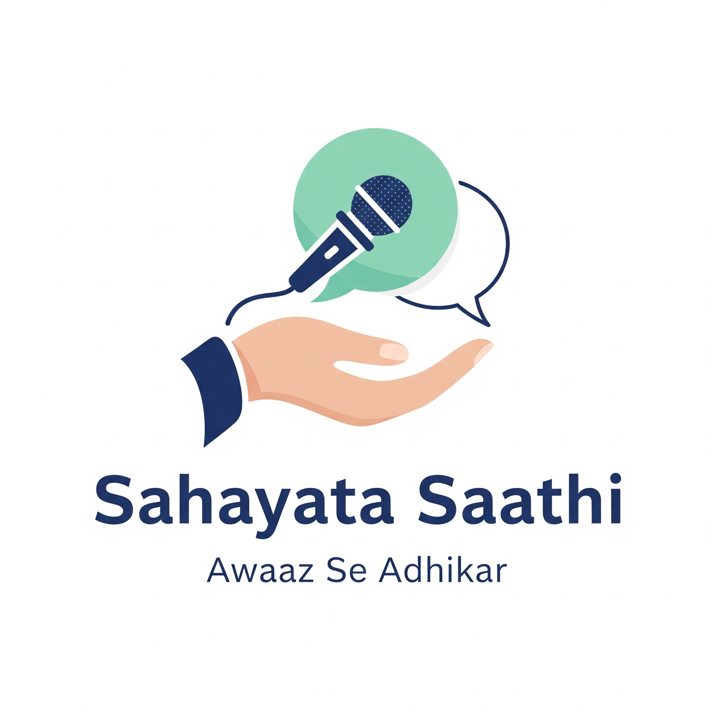

  

Sahayata Saathi (Awaaz Se Adhikar) 

An AI-powered digital companion that turns government services into a welcoming, accessible experience for everyone.

➡️ Watch the 3-Minute Demo Video Here ⬅️

🚀 The Problem
Millions of citizens are excluded from vital welfare schemes due to language barriers, digital illiteracy, and the complexity of the application process. Sahayata Saathi was built to bridge this gap, ensuring that help is accessible to everyone, regardless of their background.

✨ Our Solution: The All-Rounder Assistant
We leverage the familiarity of WhatsApp and the power of Conversational AI to create a "voice-first" guide. Our solution avoids the need for a new app, meeting users on a platform they already use and trust.

Our MVP is an "All-Rounder" assistant, an expert on multiple schemes, capable of understanding a user's unique needs and guiding them through the entire process from start to finish.

Core Features (MVP)
Real-Time Voice Understanding: The bot uses Google's Gemini 1.5 Flash model to directly transcribe voice notes in multiple Indian languages, allowing for a true voice-first interaction.

Multi-Scheme Expertise: The AI is trained as an expert on three diverse schemes (Housing, Pension, and Girl Child Savings), allowing it to handle a variety of user needs.(for now)

Intelligent Need-Based Guidance: The bot doesn't follow a rigid script. It listens to the user's problem and intelligently selects the correct scheme and guidance path.

End-to-End Assistance: For each scheme, the bot provides a complete journey: checking eligibility, listing required documents, and offering step-by-step form-filling assistance.

Persistent & Multilingual Conversations: The bot remembers the chat history for context and automatically replies in the user's language.

🛠️ Tech Stack
Platform: Twilio API for WhatsApp

AI Core: Google Gemini 1.5 Flash (for both Conversation and Audio Transcription)

Backend: Python & FastAPI

State Management (MVP): In-memory Dictionary

Deployment (MVP): Local server exposed via Ngrok

Scalability Plan (The Path Forward)
The MVP's architecture is designed for rapid and robust scaling. The next steps are:

Full Voice-Out Experience: Implement a Text-to-Speech (TTS) service to enable the bot to reply with voice notes, creating a complete voice-only experience for users with low literacy.

Database-Driven Knowledge Base: Scale the bot's expertise by migrating the scheme information from the prompt to a dedicated database (e.g., SQLite/PostgreSQL).

Implement RAG System: Use a Retrieval-Augmented Generation (RAG) approach to allow the AI to pull real-time information from the database, ensuring its answers are always accurate and easily expandable.

Cloud Deployment: Deploy the application on a PaaS like Render or Railway for 24/7 production availability.

⚙️ How to Run This Project
Clone the repository:

git clone https://github.com/bandlamuriramya/sahayata-saathi-mvp.git

Install dependencies:

pip install -r requirements.txt

Create a .env file and add your TWILIO_ACCOUNT_SID, TWILIO_AUTH_TOKEN, and GOOGLE_API_KEY.

Run the server:

python -m uvicorn main:app --reload

Expose your local server using ngrok http 8000 and configure the webhook in your Twilio sandbox.
